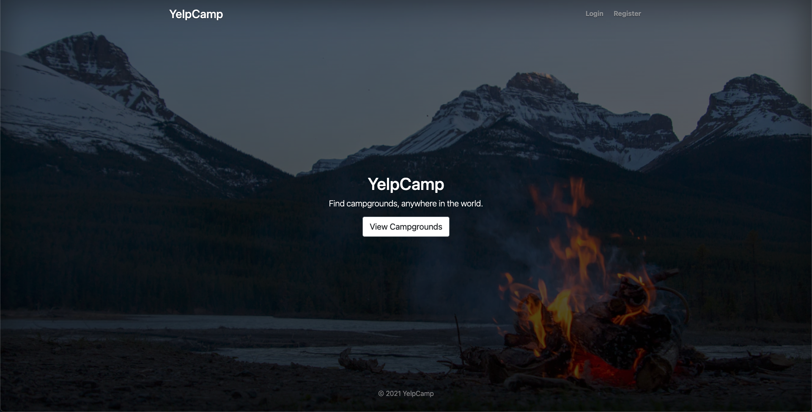
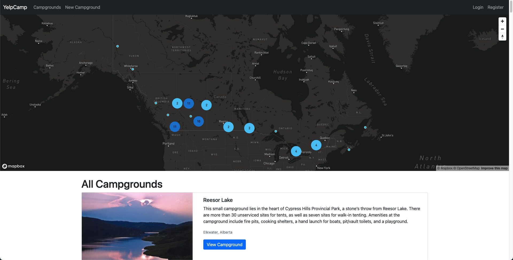
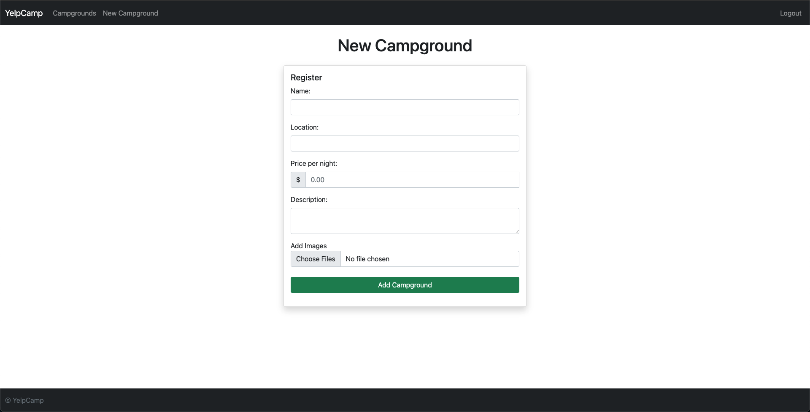
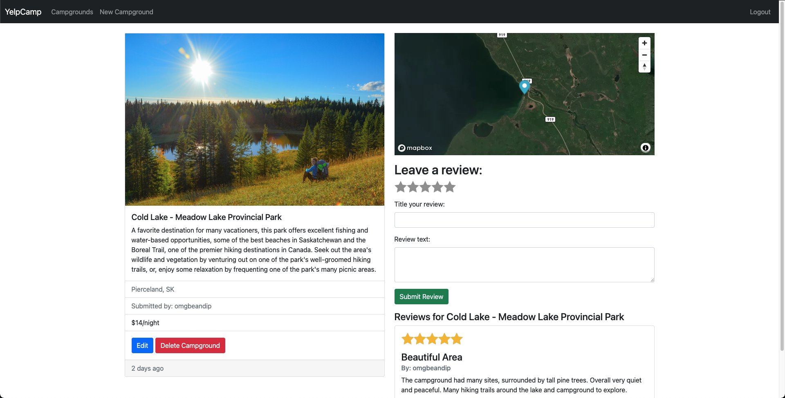

# YelpCamp

A project from Colt Steele's 2021 Web Development Course. A RESTful Node.js with full CRUD. Inspired by Yelp, users can create/edit/delete campgrounds, leave reviews, and view elegant, interactive campground maps.

## Link to App

https://shielded-depths-28887.herokuapp.com/campgrounds

## Functionality

* Users can be authenticated and authorized to protect editing and deletion of reviews and campgrounds.
* Elegant cluster and satellite maps via Mapbox can be interacted with to view campgrounds locally or globally.
* Images may be uploaded/deleted through the use of Cloudinary – a cloud-based image service.
* Users may leave reviews that mimic yelp; a 5-star rating system with titles and text body.
* Campgrounds, reviews, and users can be registered and posted to the site and stored safely and securely in MongoDB.
* Data protection and security strongholding through the use of Helmet.

## Languages, Frameworks, and Tools Used

* Front-end
  * __HTML__
  * __CSS__
  * __JavaScript__
  * [EJS](https://ejs.co/)
  * [Bootstrap](https://getbootstrap.com/docs/5.0/getting-started/introduction/)
  * [Mapbox](https://www.mapbox.com/)
* Back-end
  * __Node.js__
  * [Express](http://expressjs.com/)
  * [Mongoose](https://mongoosejs.com/)
  * [Joi](https://joi.dev/api/)
  * [Multer](https://www.npmjs.com/package/multer)
  * [Passport](http://www.passportjs.org/)
  * [Helmet](https://helmetjs.github.io/)
  * [Connect-flash](https://www.npmjs.com/package/connect-flash)
  * [Sanitize-HTML](https://www.npmjs.com/package/sanitize-html)
  * [Express-session](https://www.npmjs.com/package/express-session)
* Cloud
  * [Cloudinary](https://cloudinary.com/)
  * [MongoDB Atlas](https://www.mongodb.com/cloud/atlas)
  * [Heroku](https://dashboard.heroku.com/)
  
  ## Images
  
  
  
  
  
  ## What I learned
  * Implementing multiple moving parts into a full-sized, scaled project.
  * Blending front-end web development with Node.js, Express, Mongoose, and MongoDB Atlas.
  * Downloading, requiring, and executing npm packaging.
  * Error handling and routing.
  * Running into roadblocks/bugs and troubleshooting and debugging.
